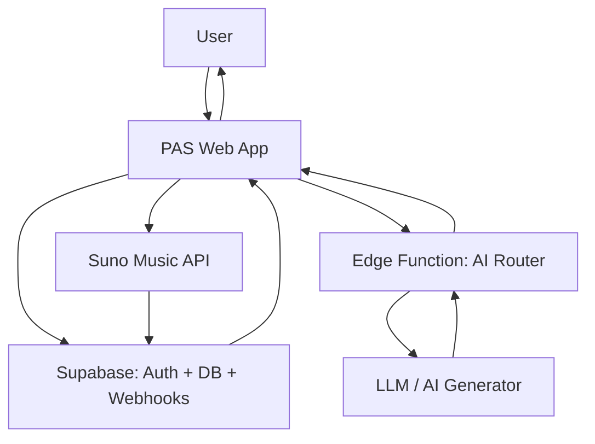
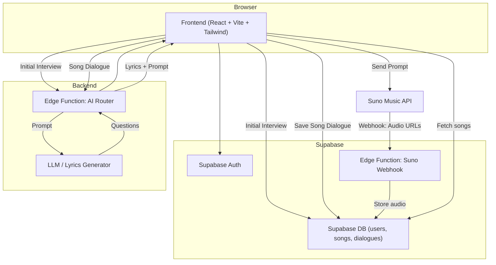
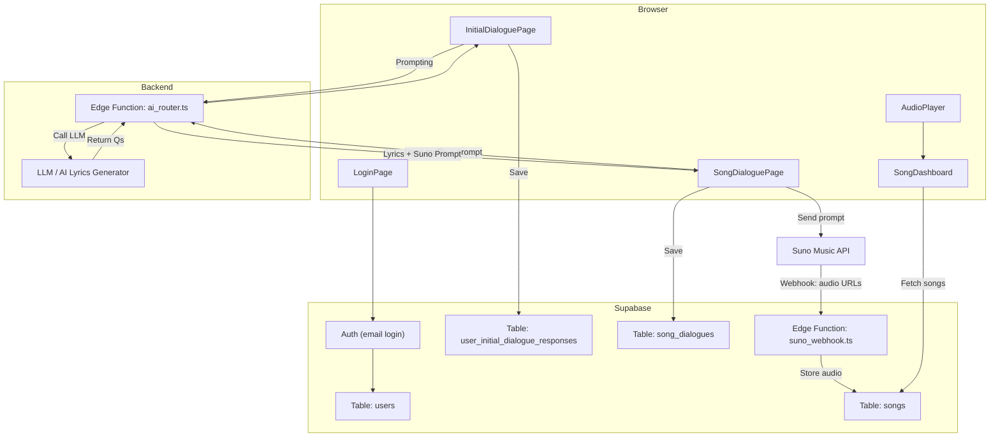
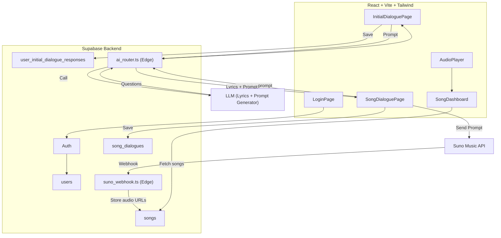

# PAS System Architecture

## Step 1: System Context Diagram (C4 Level 1)



---

## Step 2: Container Diagram (C4 Level 2)



---

## Step 3: Component Breakdown


## Step 4: All-in-One System Architecture Diagram

This unified diagram combines frontend components, backend Supabase logic, Edge Functions, LLM, Suno integration, and Supabase DB tables. It reflects both the user-facing flow and internal orchestration.


## Step 5: Technical Specification

This section provides a developer-friendly overview of PAS (Personalized Assertive Songs) system responsibilities, logic flow, and architectural contracts.

---

### 🧠 Core Idea

PAS is a personalized music generation web app that:
- Gathers user emotional context through an initial interview
- Accepts dialogue inputs to generate lyrics via an AI model
- Sends prompts to Suno API to generate song audio
- Stores all data (users, dialogues, songs) in Supabase
- Delivers songs via a frontend audio dashboard

---

### 🧩 Frontend (React + Vite + Tailwind)

| Component             | Role |
|------------------------|------|
| `LoginPage.tsx`        | Auth via Supabase (email-based) |
| `InitialDialoguePage.tsx` | First-time interview; dynamic LLM-powered questions |
| `SongDialoguePage.tsx` | Per-song input; sends to LLM via edge function |
| `SongDashboard.tsx`    | Displays completed songs (with filter) |
| `AudioPlayer.tsx`      | Renders player for Suno-generated audio |

---

### 🗄️ Supabase Backend

| Table Name                          | Description |
|------------------------------------|-------------|
| `users`                            | Registered user accounts |
| `user_initial_dialogue_responses`  | One-time interview answers |
| `song_dialogues`                   | Inputs for each new song |
| `songs`                            | Lyrics, status, audio URLs, timestamps |

| Function Name         | Role |
|-----------------------|------|
| `suno_webhook.ts`     | Receives audio URLs via POST from Suno, updates `songs` |
| `ai_router.ts`        | Calls LLM for either interview question generation or lyrics generation, based on request type |

---

### 🧠 AI & Prompt Flow (LLM Integration)

- Both **Initial Interview** and **Song Dialogue** are guided by the LLM
- A single edge function (`ai_router.ts`) handles both modes:
  - Mode A: Generate follow-up questions for initial interview
  - Mode B: Generate full song lyrics + Suno prompt
- Dialogue context is sent to the LLM in both cases
- Output is streamed back to frontend or saved

---

### 🎧 Suno Integration (Async Flow)

- After receiving a lyrics + prompt object, frontend sends request to Suno
- Suno returns **2 audio files** via **Webhook POST**
- Webhook saves data into `songs` table with:
  - `status = complete`
  - Audio URLs
  - `title`, `prompt`, `lyrics` (already present or added)

---

### 🧼 System Contracts & Best Practices

- LLM calls always go through secure backend (never from browser)
- All dialogue responses (initial + song) are persisted to Supabase
- Songs are filtered in dashboard by `status = complete`
- `.env.local` contains all secrets (`VITE_SUPABASE_URL`, `VITE_SUNO_API_KEY`)
- Frontend should remain static-deployable (e.g. on Vercel)

---

### 🧪 Future Considerations

- Add user tagging and mood classification to songs
- Add status polling for Suno task completion if needed
- Visualize user history or growth across songs

---

## Step 6: Codex Build Support Addenda

### Step 6.1: Supabase Table Schemas

> These are minimal schema definitions to guide Codex in creating backend DB code and aligning with expected API responses.

#### `users`
| Field        | Type      | Notes                     |
|--------------|-----------|---------------------------|
| `id`         | UUID      | Primary key, from Supabase Auth |
| `email`      | text      | Auth email                |
| `created_at` | timestamp | Supabase default          |

#### `user_initial_dialogue_responses`
| Field        | Type      | Notes                         |
|--------------|-----------|-------------------------------|
| `id`         | UUID      | Primary key                   |
| `user_id`    | UUID      | FK to users                   |
| `responses`  | json      | Full interview answers        |
| `created_at` | timestamp | Supabase default              |

#### `song_dialogues`
| Field        | Type      | Notes                         |
|--------------|-----------|-------------------------------|
| `id`         | UUID      | Primary key                   |
| `user_id`    | UUID      | FK to users                   |
| `input`      | json      | Dialogue text or form data    |
| `created_at` | timestamp | Supabase default              |

#### `songs`
| Field        | Type      | Notes                         |
|--------------|-----------|-------------------------------|
| `id`         | UUID      | Primary key                   |
| `user_id`    | UUID      | FK to users                   |
| `title`      | text      | Generated title               |
| `lyrics`     | text      | Full lyrics                   |
| `prompt`     | text      | Suno-compatible prompt        |
| `audio_url_1`| text      | First audio URL               |
| `audio_url_2`| text      | Second audio URL              |
| `status`     | text      | `pending` / `complete`        |
| `created_at` | timestamp | Supabase default              |

---

### Step 6.2: Sample LLM Prompts

> These prompts are used in the `ai_router.ts` edge function to generate either interview questions or full lyrics + Suno prompts.

---

#### 🎤 Prompt Mode A — Initial Interview Guidance

**Goal:** Help PAS guide users through a deeper emotional/motivational self-reflection.

```json
{
  "mode": "interview",
  "persona": "empathetic songwriting assistant",
  "context": [],
  "instruction": "Generate the next open-ended question for a reflective initial interview that will help personalize future songs. Keep it simple, warm, and emotionally focused."
}
```

✅ Can be repeated with updated `context` as dialogue evolves.

---

#### 🎼 Prompt Mode B — Song Lyrics & Music Prompt Generation

**Goal:** Turn user emotional state + current request into lyrics and a Suno-compatible prompt.

```json
{
  "mode": "song",
  "persona": "expert songwriter + music director",
  "user_profile": {
    "mood_goal": "boost confidence",
    "music_tags": ["cinematic", "female vocals", "motivational"]
  },
  "dialogue": "I have an important presentation tomorrow and feel a bit nervous. I want a song that energizes me and reminds me I'm ready.",
  "instruction": "Generate powerful, original lyrics and a short Suno music prompt that fits the emotional request. Avoid copying existing songs."
}
```

**Expected LLM output:**

```json
{
  "lyrics": "You're standing tall, the lights are on...\nThey'll hear your fire when you speak...",
  "prompt": "cinematic pop with strong female vocals, uplifting melody, motivational tone"
}
```

---

